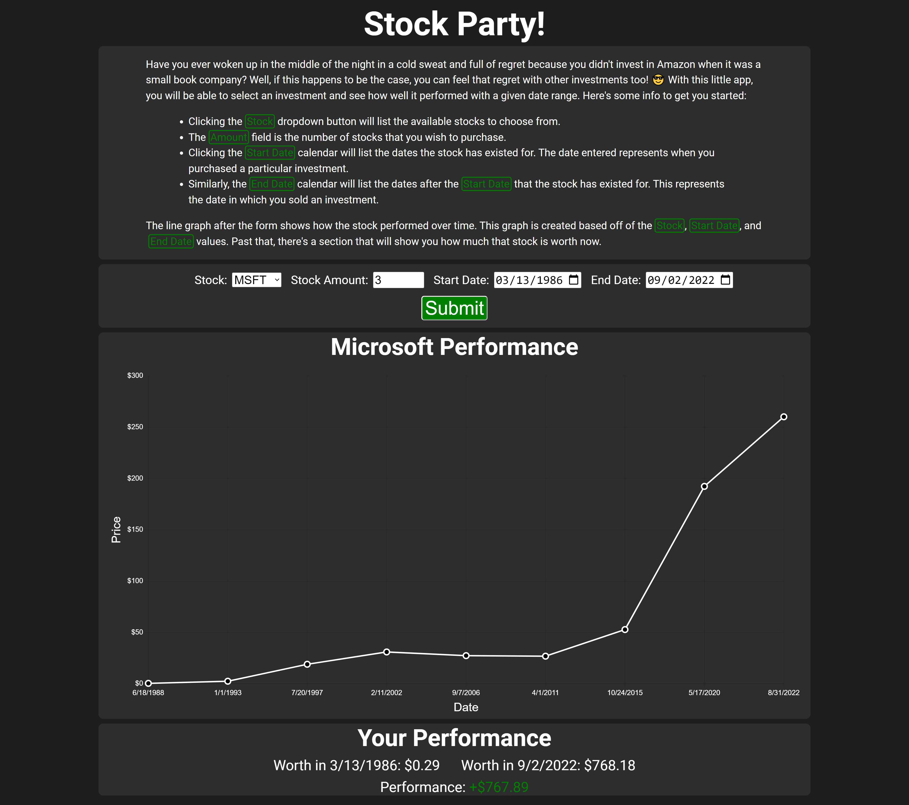

# About

This application allows a user to see how a stock has performed over the course of history. It also gives them the
option to see how much money they could have made from an initial investment. Fiddling around with investing has always
been an interest of mine and I also wanted to create a front end project using React.

This project was made with the help of Create React App which made getting a React application up and running very fast.
Additionally, the React Chart.js library was used in order to quickly made a line chart and Storybook was used in order
to test its functionality.

# The Application

## To Run the Application

`npm start`

## To Run Storybook

`npm run storybook`

## Data Collection Method

Investment data was downloaded from [Yahoo Finance](https://finance.yahoo.com) and manually transformed so that it can
be used by the application. These are the steps in order to get data into the application:

* Find a nice looking stock on Yahoo.
* Download its full historical data as a CSV file.
  * These files are stored in the `database/raw` directory.
  * This file has extra data that we don't really need.
  * CSV files are also kind of "meh" to work with.
* Run `node database/ConvertData.js` which will convert each CSV file into a much nicer JSON file.
  * The file names will be the same as the CSV file supplied.
  * These files are stored in the `database/processed` directory.
  * The JSON file will contain some meta data along with only the date and closing values of the stock instead of all
  that other jazz we don't care too much about in the CSV files.
* Profit.

I went with this method for data because APIs were either out of date or websites wanted money. **I am cheap**. I also
didn't want to go through the hassle of setting up server along with a database quite just yet.
